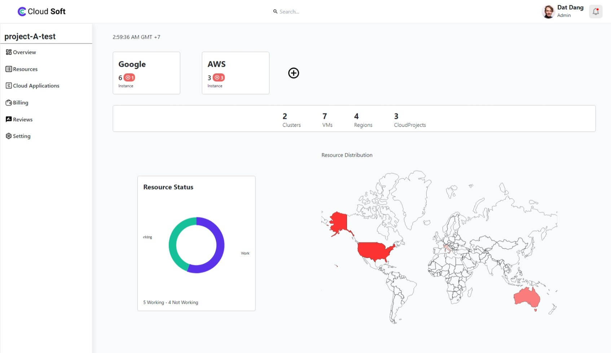
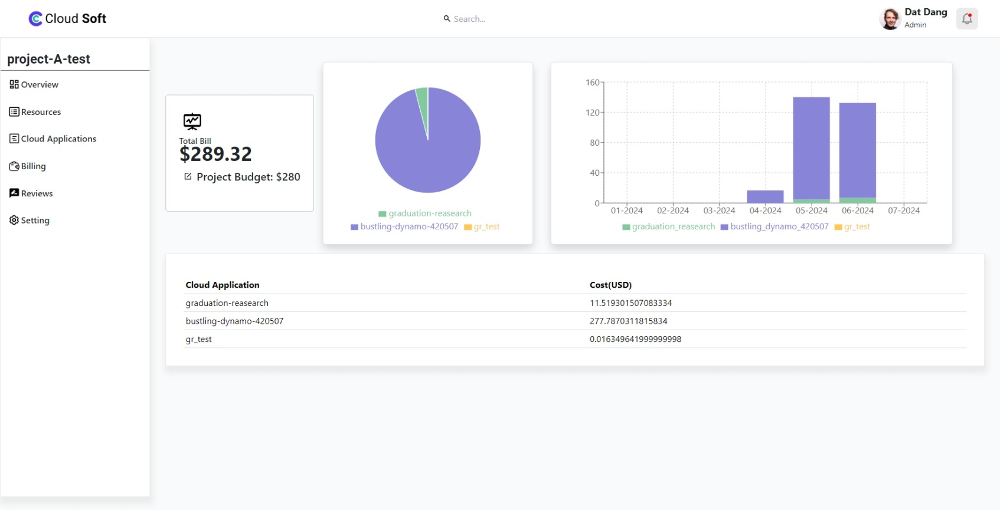
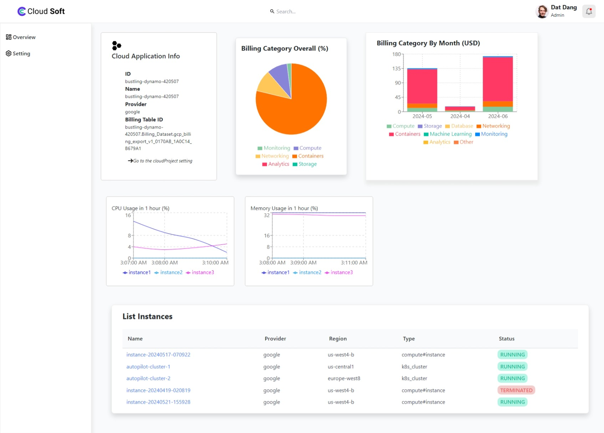
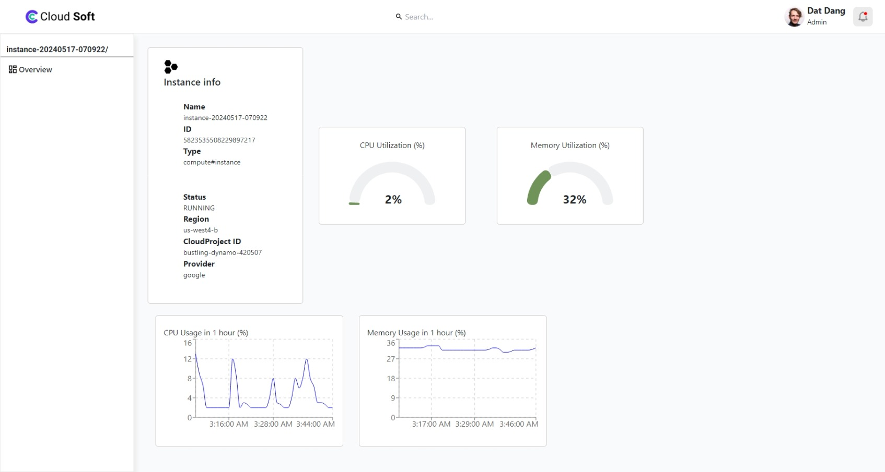
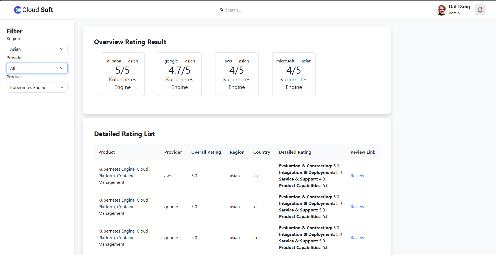

# Graduation Thesis 2023.2 HUST - SOICT

## Multi-cloud Evaluation and Management Platform

This project is for developing a comprehensive platform that facilitates the evaluation and management of multi-cloud environments. It aims to provide organizations with the ability to efficiently manage resources, billing management and recommendation service across multiple cloud service providers.

This project is graduation thesis of Cao Dang Dat-20205177

## Project Structure

The project structure is as follows:

```
- client\cloud-manager
    - public
    - src
        - components
        - contexts
        - firebase
        - pages
        - styles
        - App
    - .env
    - .gitignore
    - index.html
- server
    - config
    - controllers
    - models
    - routes
    - server.js
    - .env
- server2
    - aws
    - google
    - app.js
    - function.js
    - email.js
    - .env
- crawler
    - crawler
    - driver
    - function
    - .env
    - .gitignore
    - requirements.txt
- README.md
```

## Getting Started

#### To get started with the project, follow these steps:

1. Clone the repository.
2. Navigate to the project directory.
3. Install the dependencies by running `npm install` in both the `client\cloud-manager`, `server`, `server2` directories.
4. Create a `.env` file in the root directory and add the necessary environment variables.
5. Start the development server by running `npm run dev` in both the `client\cloud-manager`, `server`, `server2` directories.

#### For crawler function, you need to follow these step:

1. Install `python3` on your machine.
2. Download the webdriver match with your browser [here](https://www.selenium.dev/documentation/webdriver/).
3. After downloading, add that file in `driver` folder. And update the `.env` file with corresponding location of folder.
4. Install the requirements library `pip install -r requirements.txt`

#### For setting up service account of cloud service, you need to follow these step:

##### **Google Cloud Platform**

1. Create Google credential account service, you can read [here](https://cloud.google.com/iam/docs/service-accounts-create).
2. Download file `.json` into your machine then add link to `.env` file.
3. If you want to manage google cloud project, you need to add above account to your service and grant `Monitoring Viewer`, `Bigquery Data Viewer`, `Compute Viewer`.

##### **Amazon Web Service**

## Environment Variables

To run this project, you will need to add the following environment variables to your .env file

**crawler/.evn**

    MONGODB_URL= url/to/your/mongodb/
    FUNCTION_PATH= url/to/your/function/folder/on/your/machine
    DRIVER_PATH= url/to/your/driver/folder/on/your/machine

**server/.evn**

    MONGODB_URI= url/to/your/mongodb/

**server2/.evn**

    GOOGLE_APPLICATION_CREDENTIALS= /create/and/download/google/credential/profile/
    MONGODB_URI = url/to/your/mongodb/
    MAIL_USER= mail@gmail.com
    MAIL_PASS= create/mail/service/pass/and/add/here

## Features

- **Multi-cloud Management**: Manage resources across multiple cloud providers such as AWS, Google Cloud
- **Cost Optimization**: Monitor the cost of cloud services with detailed analysis and create a threshold alert for billing.
- **Recommendation**: Suggest the suitable cloud service provider based on region, service, provider.

## Technologies Used

- MongoDB
- Express.js
- React.js
- Node.js
- Python
- Selenium
- Firebase

## Documentation

[Documentation](https://storage.googleapis.com/hust-files/2024-07-02/5778168805851136/20205177_caodangdat-2023.2_3.7m.pdf)

## Screenshots











## Authors

- [@dtdng](https://github.com/dtdng)
